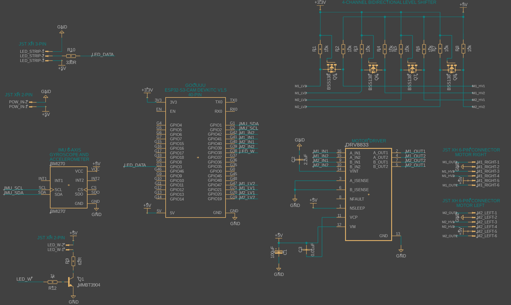
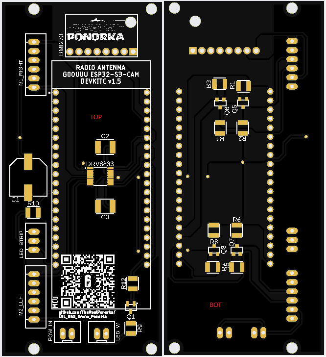
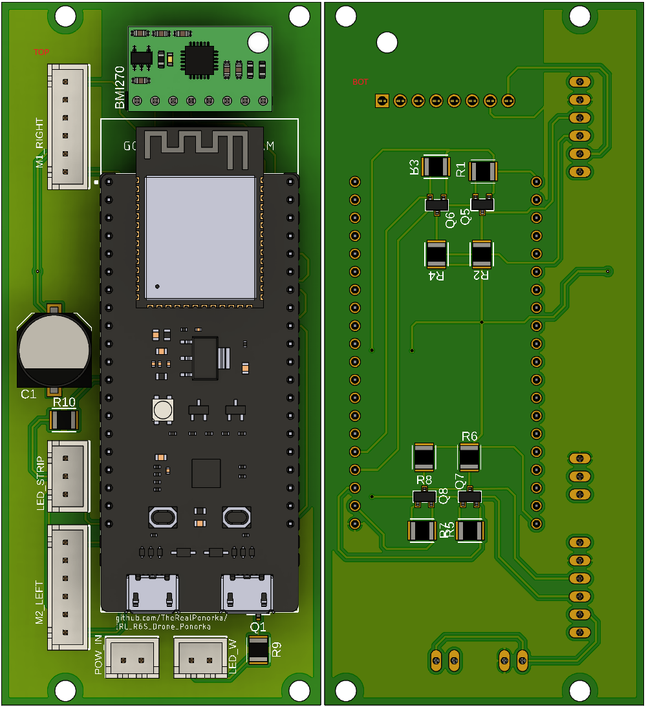
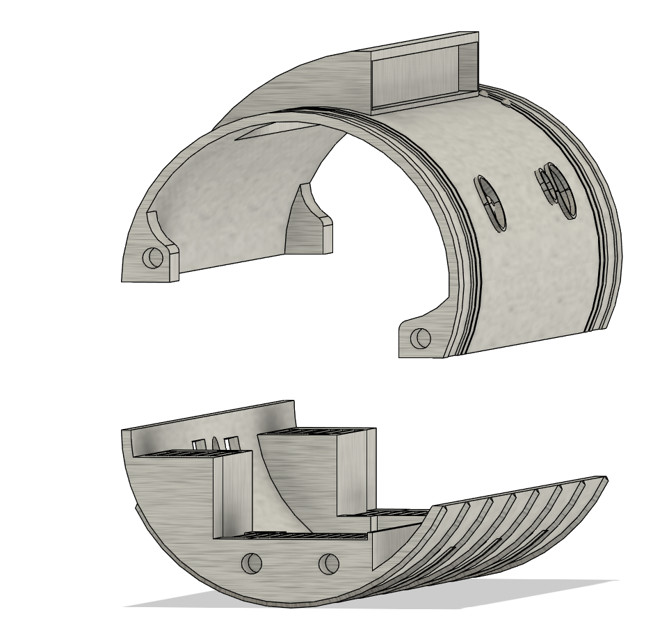
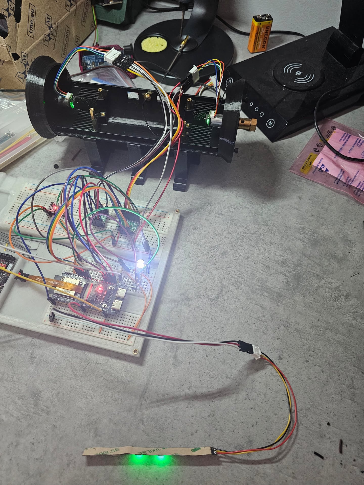

# Tom Clancy's Rainbow Six: Siege - Recon Drone by Ponorka
Last update: 22/09/2026

This project is inspired by a fictional tool called Recon drone from game Tom Clancy's Rainbow Six: Siege.
I have created a fan page on facebook for this project, where I will post some updates while I am working on it or doing some stuffs with it, here:
https://www.facebook.com/profile.php?id=61594372602997

I have built a similar drone, which was based on another github project https://github.com/hemrobotics/recon-drone and I was wondering: "Can this drone be really a fully operational 2 wheeled remote controlled drone?" This github repo should be the answer for this.

# WIP - Work In Progress
This repo is still in progress. Right now 22/09/2026 the PCB is ready and I am waiting for the supplies so I can build the prototype.
The firmware is mostly ready, but it needs polishing.
Unfortunately, my experience in coding other than PowerShell is HIGHLY LIMITED, so I apologize from everyone who might check the code and see what is happening there :D
So a lot of AI coding will be involved in this project. Sorry to everyone, I am just an enthusiast gamer in this case. In my professional life I am a SysAdmin :D

Slowly but there will be updates here to add the details about this project.

# Make it but don't sell it!
Keep in mind that this is a hobby project and I am giving it available to everyone, who is interested to build this project. So far I am not planning to make money from this and I would be happy to keep this mindset in a same way for everyone.
Don't make a hustle from this project! If you are interested, but you can't build it by yourself, ask someone, give the person all the necessary HW and pay him for the worktime, but do not sell it for profit!
I have applied proper licensing description for this reason.
If you will assemble it, credit my github/facebook fan page properly so others can reach this project as well :)
Thanks for understanding.

# Now the "FUN" Part
Okay, so if you came to this place, you probably want to build your own Recon drone (or maybe just get an inspiration, I don't know, I can't read minds :D ).
I will do my best to explain everything around so the build would be easier to complete for anyone :)

The schematics and Parts
Took me some time to get back to this knowledge, as I did not work on any electronics for several years. I figured out some basic stuffs, which were needed in addition to properly have all the stuffs working together.
As I wanted to add all the possible features what a recon drone have in R6S, I needed think over, what I want to achieve:
1. Self-balancing 2 wheeled robot
2. Camera for reconnaissance
3. LED Spotlight to light up darker places
4. Addressable RGB LED strip with 6 LEDs to replicate the visuals of the drone
5. Operate the entire drone from a single 18650 Li-Po battery cell.
6. Microphone to hear via the web stream what is happening arround. (Unfortunately could not achieve this, so I dropped this feature)

So, how to achieve that?
First we need a microcontroller (MCU) robust enough to handle all the stuffs. After reviewing all the possibilities and cost effectiveness, I decided to go with ESP32-S3 CAM DEVKITC especially from GOOUUU.
For now this is sufficient for everything we need (later on I might rethink the schematics and PCB layout with fully self-built PCB using only the MCU and not the devkit).
For camera module I decided to go with OV3660, as this module has good enough resolution, while keeping the FPS high enough to have a smooth experience.
Early build I planned with omnidirectional microphone module as well, however after further testing this came out as unusable for real time audio stream so I left this idea out of the final build.
The motors I have selected are N20 small geared motors operating on 6V with gear reduction 1:30 and built-in HAL encoder. This gives the drone possibly enough torque and power to balance, while keeping the voltage on lower side (more on it later)
The motor driver is a DRV8833, there is not much to talk about it, it is a sweet spot for this build. Low cost, low power.
The balancing is solved by IMU module BMI270, slotted on the main board.
Now here comes the power consumption part. In my previous attempt to build this drone I was happy to handle everything with only one 18650 LiPo battery cell and I wanted to keep it that way.
I have found a 18650 battery cell shield, which can handle massive current delivery at 5V (up to 3A): https://www.aliexpress.com/item/1005006252337213.html
With this solution I can easily power the ESP32, the LED strip, the motor drivers and the HAL sensors. It might not be able to run for tens of hours, but this solution should be sufficient to handle power delivery for several hours.
The battery shield needed some modifications:
- removed USB-A port
- Removed USB-C charging port and soldered cables for external USB-C connector. This was necessary to add the USB-C charging port on the back of the drone, next to the ON/OFF switch and Wi-Fi antenna.
And if you have a spare 18650 battery cell, you can replace it whenever you need inside chasis. Even though I do not recommend it, as replacement of the battery needs quite some screws to remove. This is something I did not solve in easier way yet.
There was a need to lower voltage from the motors HAL sensors. As they are operating on 5V from the battery shield, but this voltage would fry the MCU, as the MCU operates the GPIO pins with 3.3V. I needed to add a 4-channel bi-polar level shifter, so we don't fry our MCU with 5V input :)

The PCB
After several iterations of how and where the parts should be placed, I finished with this version of 2-layer PCB. The entire PCB size is 45x99.2 mm.

Already ordered PCB from manufacturer

3D overview of the final board

# The Code
This is where my knowledge is really behind, and if you will review my code later on, you might find a lot of issues with that.
The entire firmware code is based on vide coding in cooperation with Cursor. At the beginning I used Claude Sonnet 4, then I changed it to Cursor Grok 4.6
Right now, the firmware is functioning with these features on test breadboard:
- LED strip is creating the animation of the 6 ARGB LEDs based on the calculation from recorded footage of 30ms from middle to outside and back, default color is GREEN.
- Spotlight high brightness single white LED can be toggled ON/OFF
- Motors are spinning
- IMU is correctly communicating with MCU and based on the tilt it is regulating the motor movement
- MCU Wi-Fi module is correctly generating AP with SSID: "R6_Recone_Drone" and WPA password: "ReconDrone123"
- A basic (so far not modified) webserver is generated by the MCU on IP 192.168.4.1 with camera stream and buttons to operate the drone (move, LED strip color change, LED spotlight toggle, IMU data)

# The Body
I took screenshots from the game and based on it I tried to model out the outside of the drone as accurate as I could.
The body is created from 4 parts:
- TOP
- BOTTOM
- RIGH and LEFT motor/wheel holder
IT IS NOT PERFECTLY ACCURATE.
There were some challenges which I had to solve during initial test prints so it could be printed easier on 3D printer and assemble at the end.
From the front part it looks almost identical to one in the game, however the back I had to change a bit.
The top part on the back is stripped a bit, which I added for the bottom. The reason is to assemble easier the insides: USB-C charging port, Wi-Fi antenna and ON/OFF switch together with the electronics boards inside.

The motors I used are the following: https://www.aliexpress.com/item/1005012449655687.html with these specifications selected: "1 to 30, DC 6V A06 Type" and they are screwed in with really small 1.6mm screws
I have created an overengineered stand for this, you can see it on the pictures and the model.

# The test
I know, the breadboard "spaghetti" looks terrifying, but if you follow the schematics, you don't need to be afraid of it :) It is easier than you think!
Anyway, after many attempts, I have finally reached the testing state, where I can (hopefully) confidently say: IT WORKS!

# Next steps
Currently I am waiting for my final PCB (this is my 4th attempt, so my 4th order. I know I f-ed up. I did not start with breadboard testing before I ordered previous PCB attemtps) I have ordered, based on the gerber file you can find in "SchematicsAndPCB"

Hopefully, once it will arrive and solder all the components (Bill of materials, a.k.a. BOM you can find in "SchematicsAndPCB") it will finally work. Previous (3rd) version was already working, but I connected one motor signal to a PIN, which is used for Wi-Fi, so I had to redo the pinouts a bit.
